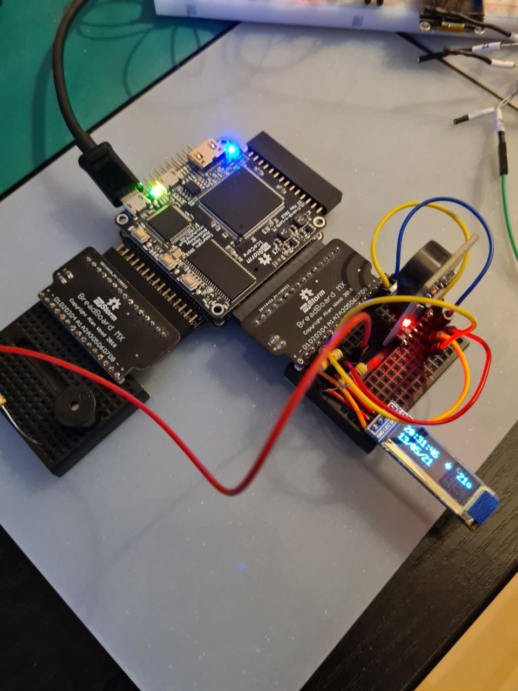

This is a fpga based rtc, temperature, oled, buzzer implementation.
This design has only few ios and the code is very easy to port to
other fpgas. This code is a hack (no cleanup) and was a fun project to learn
fpga hacking.

Needs only i2c pins, interrupt pin from rtc clock, buzzer and 2 button pins.

* sda <-> with sda of rtc clock and oled also need a pullup 4.7k
* scl <-> with scl of rtc clock and oled also need a pullup 4.7k

* btn0 <-> on fpga or take a button, configure pin as input with pullup
* btn1 <-> on fpga or take a button, configure pin as input with pullup

* led  <-> you can remove
* int_  <-> to rtc clock int/sqw with 4.7k pullup
* speaker <-> take buzzer wit 100 ohm in series to output pin

menu 
----
* btn0 jumps into the setup menu.
* btn1 will increase attributtes in setup menu.
* btn1 enable/disables alarm clock in idle screen (sign will shown).
  During alarm btn1 will silence the buzzer.

Parts you need are:
- ds3231 rtc clock
- sdd1306 128x32 bw oled display
- buzzer
- fpga with blockram for framebuffer and pla tables

This reference implementation is on ice40 based blackicemx

just build via make -f Makefile.blackicemx clean && make -f Makefile.blackicemx && make -f Makefile.blackicemx prog

Have fun
Hirosh

[
